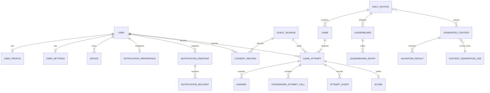

# Modelo de datos

Estado: `APPROVED`

## Convenciones

PK `uuid` (UUIDv7 cuando esté disponible); `created_at`, `updated_at`, `version`; timestamps `timestamptz` UTC; fecha editorial `date` + `market_timezone`. FKs explícitas, `NOT NULL` por defecto, enums mediante `text + CHECK` para migración simple. PII separada y cifrada cuando aplique. Soft delete (`deleted_at`) para cuenta/contenido; hard delete/anónimo para datos sin obligación; auditoría nunca mutable. JSONB solo para payload versionado o configuración variable, no relaciones principales.

## Entidades y relaciones

| Agregado / tablas | Campos/relaciones esenciales | Restricciones e índices |
|---|---|---|
| User, UserProfile, UserSettings | identidad mínima; 1:1 perfil/ajustes | email normalizado único donde activo; alias moderado; índice deleted_at |
| GuestSession, Device | guest puede migrar a user; devices de user/guest | token hash único, expires_at; device external id hash; sin fingerprint crudo |
| ConsentRecord, NotificationPreference | historial append-only; ads/analytics independientes y preferencias push actuales | consentimiento con sujeto invitado XOR usuario; preferencia por cuenta, zona IANA, quiet hours, casos y versión |
| NotificationEndpoint, NotificationDelivery | token Expo y ledger de envío | token sólo cifrado + hash único; estado/reintentos; dedupe por usuario, fecha y versión de preferencia |
| GameType, Game, DailyEdition | edición 1:N juegos; juego referencia contenido versionado | unique `(market,local_date)` no cancelada; índices status/publish_at |
| Quiz, QuizQuestion, QuizOption | quiz 1:N preguntas 1:N opciones | posición única; exactamente una correcta validada en transacción; solución en esquema/rol privado |
| Crossword, CrosswordCell, CrosswordEntry, CrosswordClue | cuadrícula/entradas/pistas | cell `(crossword,row,col)` única; entry direction/start única; checks bounds |
| WordBankEntry, ContentSource | palabra normalizada, variantes, fuente, validación | unique parcial `(locale,normalized,clue_hash)`; trigram/vector opcional tras medir |
| GameAttempt, Answer, CrosswordAttemptCell, AttemptEvent | sujeto user o guest, respuestas/celdas y eventos | XOR subject; unique competitivo; `(attempt,question|cell)` y `(attempt,client_event_id)` únicos; versión optimista |
| Score | 1:1 intento y fórmula | unique attempt; elegibility, inputs_hash, score_version |
| Streak | por usuario y tipo | unique `(user,scope)`; last_qualifying_date |
| Leaderboard, LeaderboardEntry | snapshot diario/semanal | unique scope/period; rank; unique `(leaderboard,user)` |
| Achievement, UserAchievement, ExperienceTransaction | definiciones/versiones y ledger XP | unique key/version; unique idempotency_key; XP nunca deriva de saldo mutable solo |
| Friendship, PrivateLeague, LeagueMember, Challenge | Fase 2, privacidad | pares canónicos; memberships únicos; expiración/estado |
| ContentGenerationJob, GeneratedContent, ValidationResult | lineage de generación | provider/model/prompt/config/hash/cost; índices state/type/date |
| BlockedTerm | vocabulario editorial activo y motivo | término normalizado único; cambios auditables desde backoffice futuro |
| ModerationAction, PublicationSchedule | decisión, actor, motivo, programación | append-only; unique edición/acción/versión |
| AdvertisementEvent | impresión/click/reward seudónimo | event_id único, placement, consent snapshot; retención corta |
| Subscription | entitlement externo, sin tarjeta | provider transaction id único; estado/periodo |
| FeatureFlag, Experiment, ExperimentAssignment | flags y asignación determinista | key único; subject+experiment único; variante inmutable |
| AnalyticsEvent | collector first-party, no warehouse permanente | event_id único; sujeto seudónimo, nombre/schema allowlist, consent_policy_version y TTL |
| AnalyticsEventQuarantine | metadatos sanitizados de lotes inválidos, sin payload ni sujeto | huella estructural SHA-256, motivo/count, índice received_at y TTL 30 días |
| AuditLog, OutboxEvent, IdempotencyRecord | operación, eventos e idempotencia | append-only; aggregate/version; key+scope único y request_hash |

Las entidades de Fase 2 se modelan aquí para límites, pero no se migran hasta su historia: evitar tablas especulativas.

## Diagrama esencial MVP

## Invariantes

- `DailyEdition.published_at` solo si todos los juegos seleccionados están approved y payload público generado.
- Una solución no aparece en `public_game_payload`; hash estructural en ambos permite verificar correspondencia.
- Intento tiene exactamente un sujeto efectivo; tras migración se conserva `origin_guest_session_id` auditado.
- `submitted_at`, `received_at`, `score` y elegibilidad son inmutables tras accepted salvo corrección administrativa versionada y auditada.
- Ranking se deriva de scores elegibles, nunca de valores cliente.
- Crossword: dimensiones positivas, celdas dentro, entradas conectadas, letras coherentes y clue/entry 1:1.

## Borrado y retención

| Datos | Retención |
|---|---|
| cuenta/PII | vida de cuenta + 30 días de recuperación; después anonimizar salvo obligación |
| progreso/respuestas | cuenta activa; usuario puede borrar; agregados se mantienen anónimos |
| invitados no migrados | 90 días; token 30 días |
| consentimiento/auditoría legal | plazo legal configurado (baseline 5 años, validar asesoría) |
| logs app | 30 días; seguridad 90 días según minimización |
| analítica raw seudónima | 13 meses baseline; agregados anónimos posteriores |
| cuarentena analítica sin payload | 30 días |
| generaciones/validaciones | 24 meses para trazabilidad; prompts con PII prohibida |
| idempotencia | 24 h normal, 30 días para publicación/pagos |
| backups | 30 días + mensual 12 meses sujeto a política final |

El borrado propaga tombstone a proveedores; backups expiran, no se editan. Legal hold documentado. Políticas finales requieren DPO/asesoría antes de producción.
