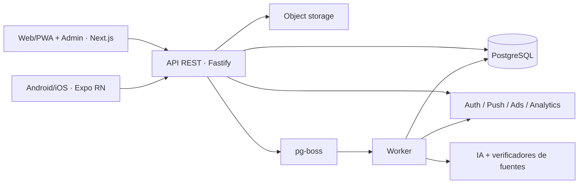
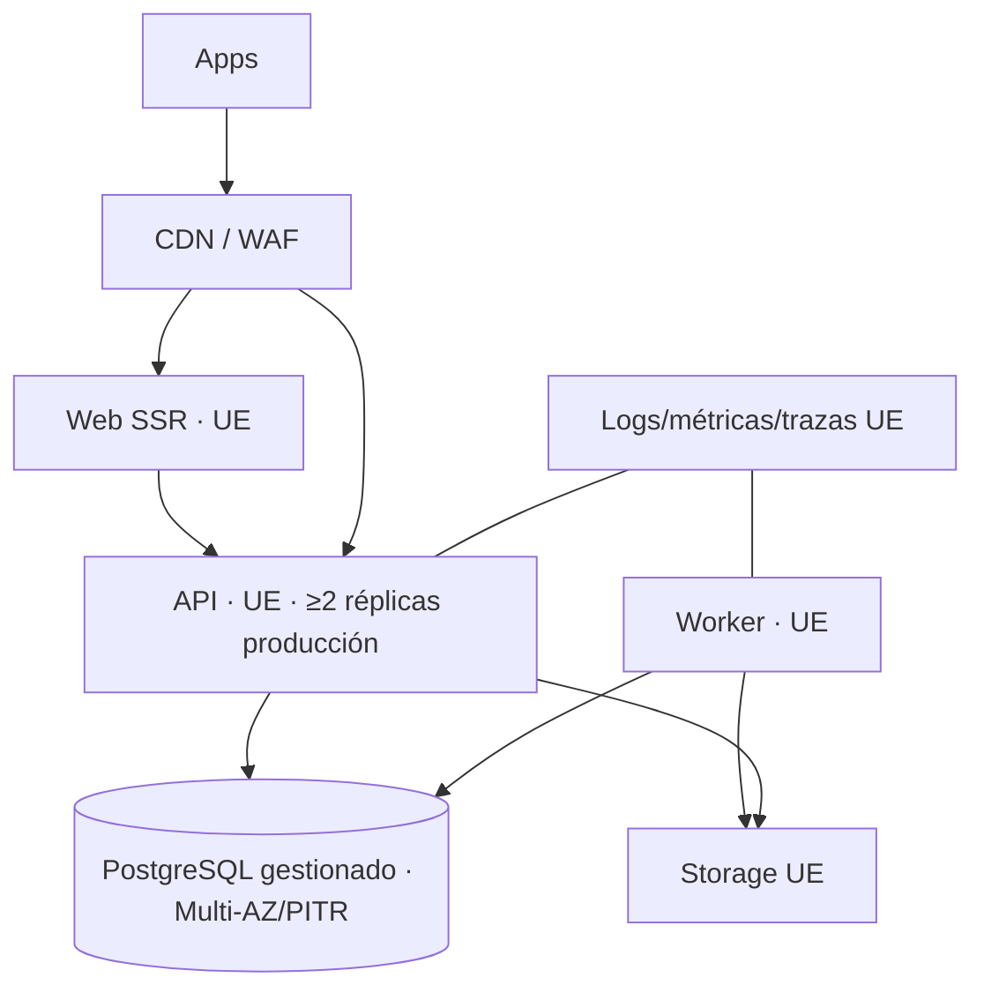

# Especificación técnica

Estado: `APPROVED`

## Arquitectura

Monorepo TypeScript, monolito modular desplegado como cuatro procesos. Los módulos de dominio no importan frameworks. No se comparten componentes de juego web/native; sí contratos, reglas, normalización y tokens.



Módulos API: identity, catalog/edition, attempts, scoring, leaderboard, content, publication, notification, consent, ads/entitlements, admin, analytics/audit. Un evento de dominio se persiste con outbox en la misma transacción; worker lo entrega al menos una vez y consumidores son idempotentes.

## Despliegue



Local usa Node 24 LTS, PostgreSQL y servicios fake explícitos; staging replica políticas con datos sintéticos; producción separa cuentas, secretos y bases. Web, API y worker despliegan independientemente desde una misma revisión compatible. Mobile usa EAS Update solo para cambios permitidos por políticas y binarios firmados para cambios nativos.

## Stack y versiones baseline

- Node.js 24 LTS, TypeScript 6.x estricto, pnpm workspaces.
- Next.js 16 App Router y React 19.2; SSR/ISR para contenido público y client islands para juegos.
- Expo SDK 56 / React Native 0.85 / Expo Router; development builds, no dependencia de Expo Go en producción.
- Fastify 5 con JSON Schema completo; TypeBox para contratos y OpenAPI.
- PostgreSQL 18 compatible, Drizzle ORM + SQL explícito para consultas críticas.
- pg-boss sobre PostgreSQL para jobs, retries, dead letter y cron.
- Vitest para unidad/integración TS, Playwright web, Maestro/Detox a decidir tras spike de accesibilidad mobile; `node:test` permitido en paquetes mínimos.

Las versiones exactas se fijan en lockfile al scaffolding y se actualizan automáticamente solo por patch/minor con CI. No se usa una versión Current no LTS de Node.

## Publicación diaria y jobs

Jobs con singleton key por edición/acción: `plan-content`, `generate-quiz`, `generate-word-bank`, `build-crossword`, `validate-content`, `select-edition`, `publish-edition`, `close-edition`, `finalize-leaderboard`, `send-notification`, `replenish-reserve`, `retention-cleanup`. Cron interpreta IANA y encola comandos con timestamp UTC calculado; publicación/cierre vuelven a comprobar DB y reloj servidor.

Retries exponenciales con jitter y máximos por clase; error permanente → DLQ + alerta. IA tiene timeout, presupuesto, circuit breaker y alternativa. Publicación no llama IA. Locks/constraints evitan doble edición y doble score. Backfill manual usa mismos comandos.

## API, caché y offline

REST JSON `/v1`, Problem Details, OpenAPI. ETag/`If-None-Match` para edición pública; CDN solo cachea DTO sin usuario/solución. Datos personales `private,no-store`. La defensa local aplica ventanas por IP y categoría con `429/Retry-After`; es sólo una red de seguridad de proceso. Antes de varias réplicas o exposición pública, el edge/WAF debe aplicar el límite distribuido persistente por IP/sujeto/riesgo y probarse bajo carga. Redis sólo se añade si la medición demuestra que el edge y PostgreSQL no cubren el caso.

PWA: precache shell/offline, stale-while-revalidate para assets versionados, network-first para edición pública con fallback cache, nunca cache de auth/admin/soluciones. IndexedDB guarda progreso/eventos cifrables por plataforma cuando sea viable; no se promete secreto frente al dueño del dispositivo. Mobile usa SQLite/secure storage según sensibilidad. Cola cliente usa IDs UUIDv7 y confirmación servidor.

## Integraciones y puertos

`AuthPort`, `ContentGeneratorPort`, `SourceVerifierPort`, `ObjectStoragePort`, `NotificationPort`, `AdsPort` (cliente), `AnalyticsPort`, `ConsentPort`, `EntitlementPort`, `Clock`, `IdGenerator`. Un puerto existe solo donde se requieren ≥2 implementaciones, fake de test o aislamiento de proveedor. Config remota/flags incluye kill switch; valores seguros embebidos si falla.

## Seguridad y autorización

Sesión web en cookies `HttpOnly Secure SameSite=Lax`: el BFF intercambia credenciales con Supabase, renueva el refresh token y reenvía solo el access token a la API. Mobile usa el SDK de Supabase con tokens en `SecureStore` y base preparada para OAuth PKCE. Access corto, refresh rotatorio y detección de reutilización; revocación por dispositivo. CSRF para mutaciones basadas en cookie, CORS allowlist, CSP estricta, HSTS, límites de payload, queries parametrizadas y validación completa.

RBAC de admin comprobado en API, MFA, reauth para publicación/borrado/flags, auditoría append-only. Soluciones en tablas/credenciales inaccesibles al rol de lectura pública; endpoint las selecciona solo si `now >= closesAt`. Protección antiabuso escalonada: rate limits, proof/challenge tras riesgo, reputación, detección de tiempo imposible y cuarentena; sin fingerprinting invasivo por defecto.

## Analítica y observabilidad

Eventos de producto pasan por esquema/versionado y seudónimo; consentimiento filtra destinos. Logs JSON con `correlationId`, `jobId`, `editionId`, código de error y sin respuestas/tokens/PII. OpenTelemetry para HTTP/DB/jobs, error tracking con scrub. Dashboards: negocio diario, contenido/reserva, API/clientes, publicación/jobs, seguridad y ads.

SLOs: edición publicada a `00:00` ±60 s (99,95%); solución disponible ≤5 min tras cierre (99,9%); API disponibilidad 99,9%. Alertas por burn rate y eventos operativos del encargo. Health solo proceso; readiness comprueba dependencias críticas sin sobrecargarlas.

## Estrategia de despliegue y recuperación

CI: formato/lint, tipos, unitarias, integración con PostgreSQL, contratos, E2E crítico, build, dependency/secret scan, migración en base efímera. Preview web por PR; staging automático; producción con aprobación, backup, migración expand/contract y canary/rolling. Rollback de app compatible; datos se recuperan con forward-fix salvo desastre.

Backups cifrados diarios + PITR objetivo 15 min, retención 30 días operativa y copia mensual según política. Ensayo trimestral a entorno aislado. RTO 4 h. Runbooks: falta de reserva, publicación, proveedor IA, DB, sync, fuga de solución, cuenta comprometida, notificaciones, ads y restauración.

## Estructura prevista

```text
apps/{web,mobile,api,worker}
packages/{domain,contracts,database,content-engine,crossword-engine,scoring,ui-tokens,config,testing}
docs/{product,specs,architecture,adr,api,analytics,security,testing,roadmap,review,runbooks}
```

No se crean `auth`, `ads`, `notifications` o `analytics` como paquetes hasta que más de una app comparta código real; comienzan como módulos/adaptadores en su consumidor.
