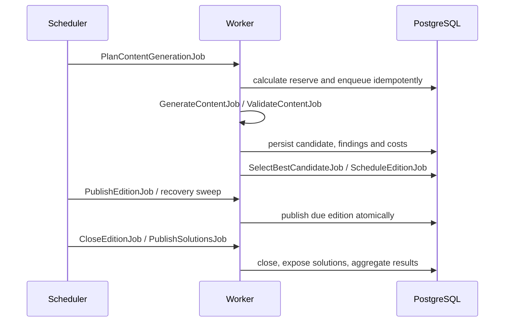

# Automation flow and scheduled jobs

Required jobs: `PlanContentGenerationJob`, `GenerateContentJob`, `ValidateContentJob`, `SelectBestCandidateJob`, `ScheduleEditionJob`, `PublishEditionJob`, `CloseEditionJob`, `PublishSolutionsJob`, `RecalculateDifficultyJob`, `RefillContentReserveJob`, `DetectDuplicateContentJob`, `CleanFailedGenerationJob` and `GenerationHealthCheckJob`.

Nominal Madrid times are 01:00 reserve, 01:10 plan, 01:15 generation, 02:30 validation, 03:00 selection, 03:15 schedule, 23:55 readiness, 00:00 publish, 00:00 close previous edition and default solution publication, 00:10 rankings, 00:20 recalibration. Each operation is also a recurring reconciliation, never only a wall-clock action. The assembler checks both the current and next local edition; after a restart it repairs a missing current edition and immediately reconciles publication.

When candidates share a type and target date, selection is deterministic: exact target date, nearest date, validation quality score (descending), recorded generation cost (ascending), creation time and ID. The stored score starts at 100 and applies explicit penalties for unverified sources, evaluator/high-risk review, semantic similarity and other validation findings. This keeps a manual approval auditable without allowing it to erase validation risk.
