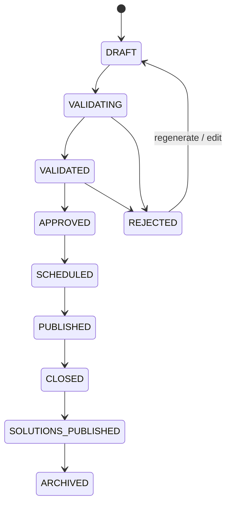

# Functional specification

## Daily edition

An edition is keyed by market and local date. It opens at the start of its ISO local day in `Europe/Madrid` and closes at the following local midnight. The instant boundaries are calculated with Temporal, never by adding 24 hours, so daylight-saving days remain correct.

Each edition contains one selected game per enabled game type and fixed configured difficulty. A special edition may share a theme; otherwise selection avoids a single theme dominating the day.

## Content candidate lifecycle

Candidate states are `DRAFT`, `VALIDATING`, `VALIDATED`, `REJECTED`, `APPROVED`, `SCHEDULED`, `PUBLISHED`, `CLOSED`, `SOLUTIONS_PUBLISHED`, and `ARCHIVED`. `REJECTED` is terminal for that revision; regeneration creates a new attempt linked to its predecessor. Manual edits return a candidate to `VALIDATING`.

The current edition storage has a smaller operational state machine (`draft`, `validating`, `approved`, `scheduled`, `published`, `closed`, `archived`, `rejected`, `cancelled`). Candidate state is the richer workflow projection; an edition is not selected until its candidate is approved.

## Automation

At least once daily, planning measures eligible reserve per type, locale and difficulty. It queues only the shortage plus a small candidate surplus. Generation produces dated candidates; validation precedes selection. A recovery pass continuously reconciles due editions, so an outage at midnight is repaired as soon as a worker returns.

The MVP uses an explicit fixed daily target per game type: crossword and word search use level 2, quiz uses level 2, and true/false plus guess-word use level 1. The target is stored with each job, survives retries and emergency requeues, and is checked against the generated payload before approval. Adaptive selection remains a later opt-in mode.

At close, competitive attempts are finalized and new competitive attempts are refused. Solutions are exposed atomically at close by default; an installation may configure a small delay, in which case the solution job is still idempotent and must run after close.

## Administration

Administrators can inspect reserve and calendar, preview content, inspect validation and source records, approve/reject/edit/regenerate, schedule or publish an emergency edition, and block terms. Every mutation requires a reason and creates an audit record. Editing a selected or published game creates a replacement candidate rather than changing historical results.

## Acceptance behaviour

No edition is published without validated content, a private solution and a valid time window. If normal selection fails, the system chooses an approved reserve candidate; if this also fails, it publishes a deterministic prevalidated emergency edition. The home page must never be intentionally empty.
