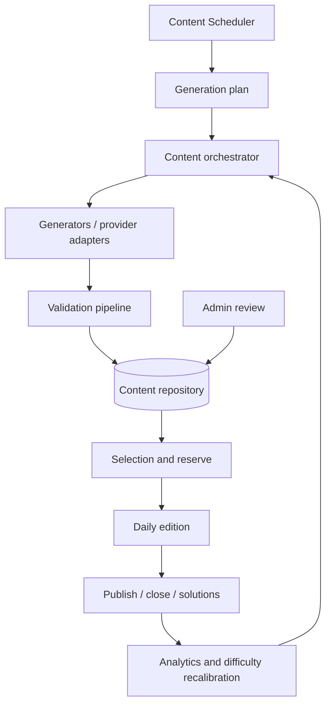

# Motor de contenido diario

## Objetivo

Lúdico debe preparar, validar y publicar una edición diaria en `Europe/Madrid` sin intervención humana. El MVP contiene crucigrama, quiz, verdadero/falso, adivina la palabra y sopa de letras, con dificultad de 1 a 5 y una reserva mínima de catorce días.

La edición pública nunca incluye respuestas: los datos jugables viven en `games.public_payload` y las soluciones en `game_solutions.private_payload`. La publicación de soluciones ocurre únicamente después del cierre.

## Arquitectura

`@ludico/domain` contains deterministic rules and generator interfaces. The worker owns scheduling, retries and adapters. PostgreSQL is the source of truth, the lock coordinator and the audit store; no new Redis dependency is introduced for the MVP.

## Scope and non-goals

The engine supports fixed difficulty in the MVP and stores the signals required for later adaptive recommendations. It does not generate a different game per player, expose future editions, or depend on a live AI call to keep the home page populated.

## Current baseline

The repository already has daily edition reconciliation, private solutions, audit/outbox events, a content job table, a review panel, deterministic quiz/crossword validation and a seeded crossword builder. Slices below extend these components rather than replace them.
