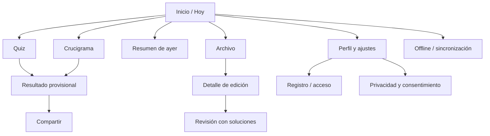

# Especificación UX/UI

Estado: `APPROVED` · Principio: mobile-first, WCAG 2.2 AA

## Arquitectura de información

- **Hoy:** edición, progreso, resumen de ayer.
- **Jugar:** quiz y crucigrama (rutas profundas por edición/juego).
- **Resultados:** resultado actual, revisión histórica pública tras cierre.
- **Archivo:** últimos 7 días en MVP; desbloqueos posteriores no competitivos.
- **Perfil:** racha, nivel/XP básico, ajustes, cuenta, privacidad.
- **Admin:** espacio separado por autorización, nunca enlazado para público.

Web: barra superior y navegación inferior en móvil; lateral en escritorio/admin. Mobile: tabs Hoy, Archivo, Perfil; pantalla de juego fuera de tabs para foco. Volver nunca descarta sin aviso.

## Mapa de pantallas



## Wireframes principales

```text
HOY
┌ Lúdico             racha 4 🔥 ┐
│ Martes, 28 de julio          │
│ [Quiz  0/10]  [Jugar]        │
│ [Crucigrama 32%] [Continuar] │
│ ─ Ayer ya tiene solución ─   │
│ 780 pts · percentil 71       │
│ [Revisar respuestas]         │
│ [espacio publicitario seguro]│
└ Hoy    Archivo    Perfil ────┘

QUIZ
┌ 3 de 10         Guardado ✓   ┐
│ Pregunta…                    │
│ ○ Opción A                   │
│ ○ Opción B                   │
│ ○ Opción C                   │
│ ○ Opción D                   │
│ [Anterior]        [Siguiente]│
└ sin corrección hasta cierre ─┘

CRUCIGRAMA
┌ 4 Horizontal      Guardado ✓ ┐
│ [ cuadrícula con foco ]      │
│ Pista de la palabra activa   │
│ [teclado accesible / nativo] │
│ [Pistas]          [Finalizar]│
└ anuncio nunca aquí ──────────┘
```

## Flujos críticos

- Primera visita: home útil antes del CMP; preferencias no esenciales tras explicación; “Jugar” no exige registro.
- Finalización: confirmar respuestas vacías → enviar → estado pendiente → resultado provisional → compartir/crear cuenta. Reintento no duplica.
- Registro: explicar beneficio contextual → método → verificación → migración → confirmación de progreso conservado.
- Offline: banner discreto “Sin conexión · progreso en este dispositivo”; al reconectar “Sincronizando” y después “Guardado”; conflicto explicable.
- Revisión: bloqueo previo al cierre muestra hora local exacta; después, comparación pregunta a pregunta/celda a celda.

## Estados

| Estado | Tratamiento |
|---|---|
| carga | skeleton con dimensiones estables; no spinner sobre controles |
| vacío | explicación y acción; ranking vacío muestra percentil pendiente |
| error recuperable | conservar datos, mensaje, reintentar |
| error terminal | código de soporte/correlation ID, volver a Hoy |
| offline | contenido disponible y límites claros |
| sincronización | icono + texto; nunca solo color |
| cerrado durante juego | permite terminar casual; explica exclusión competitiva |
| juego desactivado | tarjeta informativa, otros juegos siguen disponibles |

## Sistema de diseño

Tokens compartidos: color, tipografía, espacio, radio, elevación, duración y z-index. Base: crema `#FFF9EF`, azul noche `#17233C`, coral `#D94F4F` sujeto a contraste, verde `#16705A`; tema oscuro equivalente validado. Tipografía de sistema en MVP para rendimiento. Escala 4/8 px; objetivos táctiles ≥44×44 CSS px; ancho de lectura ≤70 caracteres.

Componentes: Button, Link, Card, GameCard, Progress, StatusBadge, Dialog, Toast, Field, SegmentedControl, AdSlot, ConsentPanel, OfflineBanner, ScoreBreakdown, ShareCard; QuizOption y CrosswordGrid son específicos. Variantes se limitan a usos reales.

## Responsive y comportamiento

320 px mínimo; una columna hasta 767, contenido + rail opcional desde 1024. Crucigrama usa el menor de ancho disponible y altura útil, zoom del sistema permitido y panel de pistas deslizable. Desktop admite teclado físico; mobile teclado propio accesible/nativo sin impedir lector.

## Accesibilidad

- Orden DOM lógico, landmarks, skip link, foco visible y restaurado tras navegación/dialog.
- Quiz con `fieldset/legend`, estados anunciados sin revelar corrección.
- Crucigrama ofrece dos vistas sincronizadas: cuadrícula y lista estructurada de pistas/campos. Cada celda anuncia coordenada, número, palabra/dirección y letra introducida; flechas navegan, Space cambia dirección, Backspace borra/retrocede.
- Contraste AA, texto a 200%, reflow 400%, reducción de movimiento, sin límite de tiempo obligatorio.
- Errores asociados al campo y resumen; vibración/sonido siempre redundantes y desactivables.

## Movimiento y anuncios

Microinteracciones ≤200 ms, no bloqueantes; confeti solo tras completar, sin autoplay con `prefers-reduced-motion`. `AdSlot` reserva tamaño para evitar CLS, lleva etiqueta “Publicidad”, está separado ≥24 px de acciones y desaparece limpiamente si no carga. Ningún anuncio en el viewport de introducción del crucigrama ni antes de comprender la tarea. Premium futuro sustituye el slot por contenido, no por hueco.
